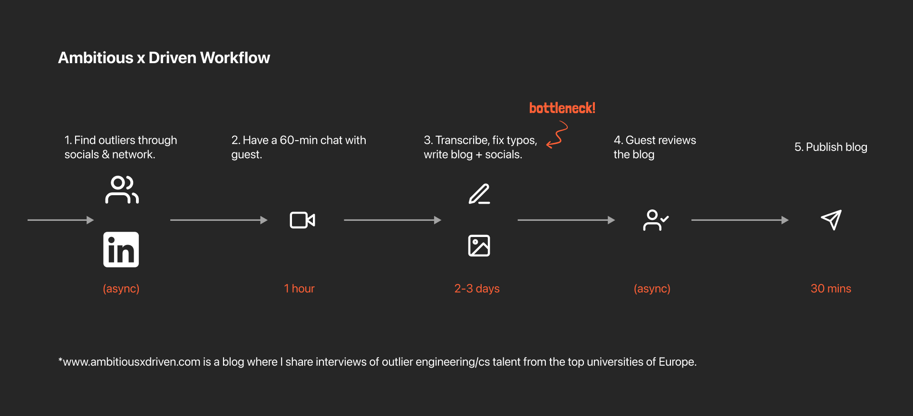
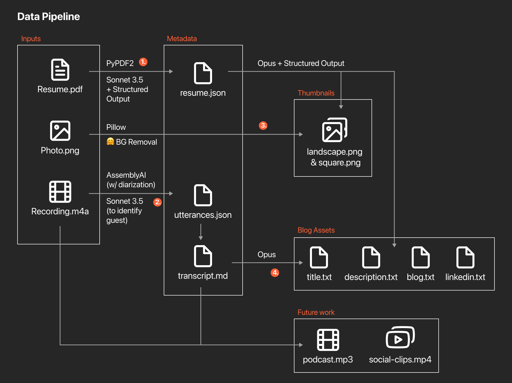
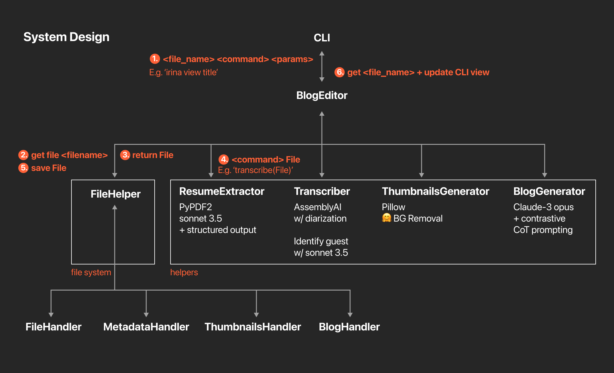

# Blog Editor

A CLI tool to easily transcribe, generate thumbnails and generate blog assets (title, description, blog, linkedin) for a given .m4a audio file.

### Demo:
https://github.com/user-attachments/assets/35e19e20-e7df-443e-995c-37b2b10227ed

## Problem Context

This is the current workflow for creating a blog post (for my newsletter, [Ambitious x Driven](https://www.ambitiousxdriven.com)):


As you can see, the major bottleneck for c
ontent production is preparing the blog assets from the recording.

As this is a side-project (that I'm doing next to my full-time CS Masters @ ETH Zurich), this would be unsustainable on the long-run.

Thus, I decided to build a Python CLI tool leveraging the latest LLMs & prompt-engineering techniques that would automate this workflow.

## Data processing pipeline

Here is a diagram that shows the processing pipeline for the blog writer.



To generate the blog assets, you need to input an audio file, a PDF resume, and a photo of the guest.
It then:

1. Extracts the guest details from the resume
2. Transcribes the audio file (using AssemblyAI w/ speaker diarization)
3. Generates landscape + square thumbnails in the Ambitious x Driven style by using an 🤗 Hugging Face Image Segmentation model & the resume details
4. Generates a blog post, title, description and LinkedIn post using the guest details(to reduce hallucinations + fix transcription errors) and transcript.

[Design]
Below is the system design for the blog writer.


- I created a separate File Helper class + FileHandlers that directly interact with the file system (as it's more convenient for a personal project + viewing the outputs).
- I encapsulate each Blog 'component' into a separate schema and helper class ('Files', 'Metadata', 'Thumbnails', 'Blog').

Here is how a typical file change happens (e.g. generating a title)

1. User requests a file from the CLI (we are requesting files as there are multiple Zoom recordings in the folder)
2. The BlogEditor class requests the file from the FileHelper
3. The FileHelper parses together all the files using the relevant FileHandlers, then returns it to the BlogEditor (then CLI for viewing)
4. Then, through the CLI, the user can apply relevant functions (e.g. generate all, transcribe, edit, ...). The BlogEditor gets the latest file, applies the requested function, saves the file, then returns it to the CLI for viewing.

## Usage

On MacOS:

```bash
# Create virtual environment
python3 -m venv venv

# Activate virtual environment
source venv/bin/activate

# Install dependencies
pip install -r requirements.txt
```

#### Required changes before using:

- Update the Zoom folder path in `blog_editor.py`
- You'll have to write your own `prompts.py` file (I can provide a skeleton if it's needed - reach out here: http://linkedin.com/in/anirudhhramesh/ or anirudhh.ramesh[AT]gmail.com)
- You'll have to include a .env file following the `env.example` file

#### Required files

- Provide .m4a/.mp3 2-person interview (with one guest and one interviewer)
- Provide resume.pdf (of the guest)
- Provide photo.png (of the guest) - needs to end with photo.png

Then:

```bash
python cli.py
```

This will run & open the CLI interface. I recommend going into full-screen terminal mode before running this.

## Features

In the CLI interface:
- list (see all the blogs found in your Zoom folder)
- get <blog_name> (get the blog with the given name, this will be your 'working blog')
- generate all (generate all the attributes for the blog)
- edit <attribute> <value> (edit the attribute with the given value)
- publish (publish the blog to notion)
- reset all (reset all the attributes for the blog) - (NOT YET IMPLEMENTED)
- reset <attribute> (reset the attribute with the given value) - (NOT YET IMPLEMENTED)

## Prompt-engineering details for generating a human-sounding 'true-to-transcript' blog

- I probably will write a paper on this, so I'll share more details once that's prepared :)
- In the meantime, I'm looking for labs/researchers to advise the paper-writing, if you're interested email me please: anirudhh.ramesh[AT]gmail.com

### Citations

I use the [BiRefNet model](https://github.com/ZhengPeng7/BiRefNet) for image segmentation model from Hugging Face. This one seemed to work best out of the couple I tried.
